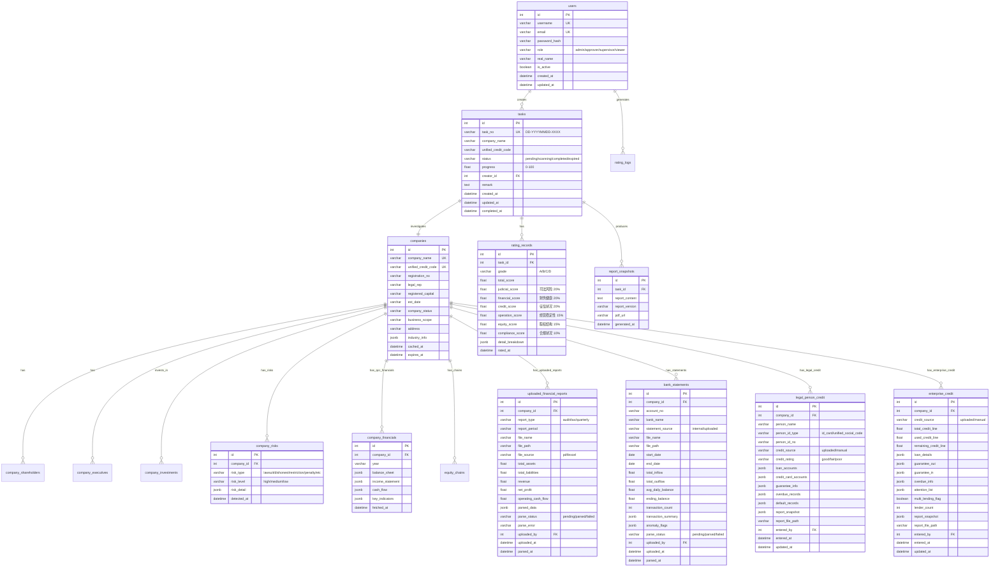
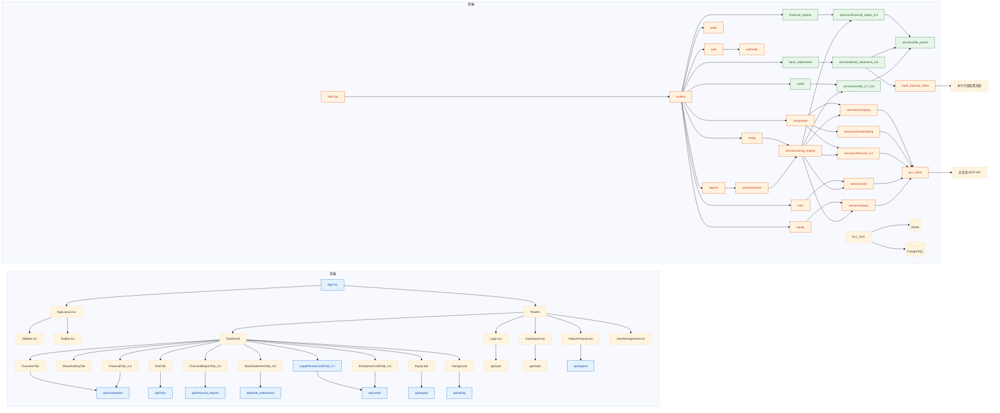
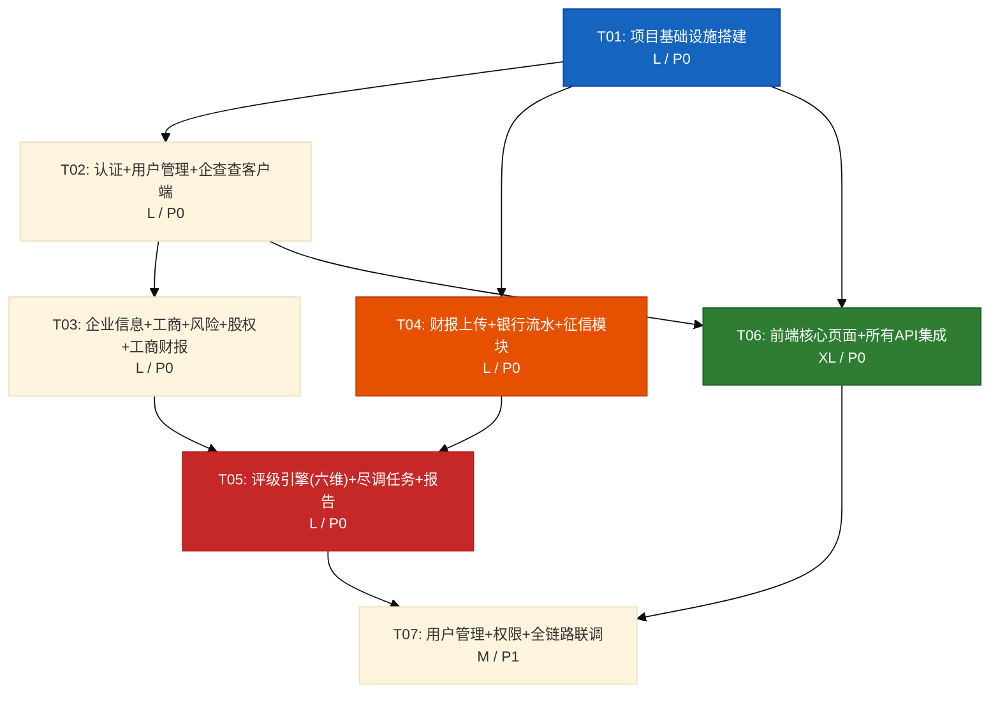

# 银行授信尽调系统 — 系统架构设计

> **版本**: v2.0 | **作者**: Bob (架构师) | **日期**: 2026-05-28
>
> **变更说明**: 基于 PRD v1.0（12 模块完整版）重写。新增财报上传(3.5)、银行流水(3.6)、法人征信(3.7)、企业征信(3.8) 四大模块；评分模型从五维升级为六维；数据源从 1 种扩展为 4 种。

---

## 1. 技术选型

### 1.1 前端

| 类别 | 选型 | 理由 |
|------|------|------|
| 构建工具 | **Vite 6** | 快速 HMR，生态成熟 |
| 框架 | **React 19 + TypeScript** | 组件化开发，类型安全 |
| UI 库 | **MUI 6 (Material UI)** | 企业级组件丰富，主题定制灵活 |
| CSS | **Tailwind CSS 4** | 原子化 CSS，快速原型 |
| 状态管理 | **Zustand** | 轻量，无样板代码，适合中大型应用 |
| 路由 | **React Router 7** | React 官方路由方案 |
| HTTP 客户端 | **Axios** | 拦截器、超时控制、请求取消 |
| 图表 | **ECharts** | 股权穿透图、财务图表、流水趋势可视化 |
| 文件上传 | **@mui/lab/Upload** + Axios | 分片上传、进度条、大文件支持 |
| PDF 预览 | **react-pdf** | 前端报告预览 |

### 1.2 后端

| 类别 | 选型 | 理由 |
|------|------|------|
| 框架 | **FastAPI** | 高性能异步，自动 OpenAPI 文档 |
| ORM | **SQLAlchemy 2.0 (async)** | 成熟异步 ORM |
| 数据库迁移 | **Alembic** | SQLAlchemy 官方迁移工具 |
| 认证 | **JWT (PyJWT)** + **passlib[bcrypt]** | 行业标准认证方案 |
| 任务队列 | **Celery + Redis** | 企查查 API 异步调用、报告生成、文件解析 |
| 缓存 | **Redis** | 企业数据缓存，降低 API 调用 |
| 数据库 | **SQLite (开发)** / **PostgreSQL (生产)** | SQLAlchemy 统一抽象 |
| PDF 生成 | **WeasyPrint** | 后端高质量 PDF 生成 |
| Excel 解析 | **openpyxl** | 解析客户上传的 Excel 财报和银行流水 |
| PDF 解析 | **pypdf** | 解析客户上传的 PDF 财报和征信报告 |
| 文件上传 | **python-multipart** | FastAPI 文件上传支持 |
| 企查查 | **MCP 工具 (通过 Skill 调用)** | 使用已有企查查 MCP Connector |

### 1.3 基础设施

| 类别 | 选型 |
|------|------|
| 容器化 | Docker + Docker Compose |
| 反向代理 | Nginx |
| 日志 | Loguru (Python) + Pino (前端开发) |
| 环境变量 | python-dotenv |

---

## 2. 系统架构


**数据源说明**：

| 数据源 | 获取方式 | 覆盖模块 |
|---|---|---|
| 企查查 MCP API | 后端自动调用 | 3.1-3.4（工商/司法/工商财报）、3.9（股权穿透） |
| 本行内部结算系统 | 后端自动拉取 | 3.6（银行流水） |
| 客户上传文件 | 前端上传，后端解析 | 3.5（审计财报/税务财报）、3.6（流水文件） |
| 审批员手动录入 | 前端表单录入 | 3.7（法人征信）、3.8（企业征信） |

---

## 3. 数据库设计

### 3.1 ER 图



### 3.2 核心表说明

| 表名 | 用途 | 数据源 | 缓存策略 |
|------|------|--------|----------|
| `users` | 用户管理 | 系统内部 | 无 |
| `tasks` | 尽调任务管理 | 系统内部 | 无 |
| `companies` | 企业基础信息缓存 | 企查查 API | Redis TTL 24h |
| `company_shareholders` | 股东信息缓存 | 企查查 API | Redis TTL 24h |
| `company_executives` | 高管信息缓存 | 企查查 API | Redis TTL 24h |
| `company_investments` | 对外投资缓存 | 企查查 API | Redis TTL 24h |
| `company_risks` | 风险数据缓存 | 企查查 API | Redis TTL 12h |
| `company_financials` | 工商财报数据(3.4) | 企查查 API | Redis TTL 72h |
| `uploaded_financial_reports` | 客户上传财报(3.5) | 文件上传+解析 | 无 |
| `bank_statements` | 银行流水(3.6) | 本行系统/文件上传 | 无 |
| `legal_person_credit` | 法人征信(3.7) | 文件上传/手动录入 | 无 |
| `enterprise_credit` | 企业征信(3.8) | 文件上传/手动录入 | 无 |
| `equity_chains` | 股权穿透路径 | 企查查 API | Redis TTL 24h |
| `rating_records` | 评级记录持久化（六维） | 评级引擎 | 无 |
| `report_snapshots` | 报告快照 | 报告生成器 | 无 |

---

## 4. API 接口设计

### 4.1 认证

| 方法 | 路径 | 说明 | 请求体 | 响应 |
|------|------|------|--------|------|
| POST | `/api/auth/login` | 用户登录 | `{username, password}` | `{token, user}` |
| POST | `/api/auth/refresh` | 刷新 Token | `{refresh_token}` | `{token}` |
| POST | `/api/auth/logout` | 登出 | - | `{ok}` |

### 4.2 用户管理 (Admin)

| 方法 | 路径 | 说明 |
|------|------|------|
| GET | `/api/admin/users` | 用户列表 |
| POST | `/api/admin/users` | 创建用户 |
| PUT | `/api/admin/users/:id` | 更新用户 |
| DELETE | `/api/admin/users/:id` | 删除用户 |

### 4.3 尽调任务

| 方法 | 路径 | 说明 | 关键参数 |
|------|------|------|----------|
| GET | `/api/tasks` | 任务列表 | `page, page_size, status, creator` |
| POST | `/api/tasks` | 创建尽调任务 | `{company_name, remark}` |
| GET | `/api/tasks/:id` | 任务详情 | - |
| PUT | `/api/tasks/:id` | 更新任务 | `{remark, status}` |
| DELETE | `/api/tasks/:id` | 删除任务 | - |
| POST | `/api/tasks/:id/scan` | 触发全量扫描 | - (异步) |
| GET | `/api/tasks/:id/progress` | 查询扫描进度 | - |

### 4.4 企业信息

| 方法 | 路径 | 说明 | 关键参数 |
|------|------|------|----------|
| GET | `/api/companies/search` | 企业模糊搜索 | `q` (关键词) |
| GET | `/api/companies/:id` | 企业基本信息 | - |
| GET | `/api/companies/:id/shareholders` | 股东信息 | - |
| GET | `/api/companies/:id/executives` | 高管信息 | - |
| GET | `/api/companies/:id/investments` | 对外投资 | - |
| GET | `/api/companies/:id/financials` | 工商财报数据(3.4) | `year?` |
| GET | `/api/companies/:id/verify` | 企业身份核验 | `{name, credit_code}` |

### 4.5 风险扫描

| 方法 | 路径 | 说明 |
|------|------|------|
| GET | `/api/companies/:id/risks` | 全部风险汇总 |
| GET | `/api/companies/:id/risks/lawsuits` | 诉讼记录 |
| GET | `/api/companies/:id/risks/dishonest` | 失信记录 |
| GET | `/api/companies/:id/risks/restrictions` | 限高记录 |
| GET | `/api/companies/:id/risks/penalties` | 行政处罚 |

### 4.6 财报数据 (3.5 新增)

| 方法 | 路径 | 说明 | 关键参数 |
|------|------|------|----------|
| POST | `/api/companies/:id/financial-reports/upload` | 上传财报文件 | `file` (multipart) |
| GET | `/api/companies/:id/financial-reports` | 财报列表 | - |
| GET | `/api/companies/:id/financial-reports/:rid` | 财报详情 | - |
| POST | `/api/companies/:id/financial-reports/:rid/parse` | 触发解析 | - (异步) |
| GET | `/api/companies/:id/financial-reports/compare` | 多期对比 | `ids` (逗号分隔) |
| DELETE | `/api/companies/:id/financial-reports/:rid` | 删除财报 | - |

### 4.7 银行流水 (3.6 新增)

| 方法 | 路径 | 说明 | 关键参数 |
|------|------|------|----------|
| POST | `/api/companies/:id/bank-statements/fetch` | 从本行系统拉取 | `{account_no, start_date, end_date}` |
| POST | `/api/companies/:id/bank-statements/upload` | 上传流水文件 | `file` (multipart) |
| GET | `/api/companies/:id/bank-statements` | 流水列表（多账户） | - |
| GET | `/api/companies/:id/bank-statements/:sid` | 流水详情+统计分析 | - |
| GET | `/api/companies/:id/bank-statements/:sid/trend` | 流水趋势数据 | - |
| GET | `/api/companies/:id/bank-statements/summary` | 多账户汇总 | - |
| DELETE | `/api/companies/:id/bank-statements/:sid` | 删除流水 | - |

### 4.8 法人征信 (3.7 新增)

| 方法 | 路径 | 说明 | 关键参数 |
|------|------|------|----------|
| POST | `/api/companies/:id/legal-person-credit/upload` | 上传征信报告 | `file` (multipart) |
| POST | `/api/companies/:id/legal-person-credit` | 手动录入征信信息 | `{person_name, person_id_no, loan_accounts, ...}` |
| GET | `/api/companies/:id/legal-person-credit` | 法人征信列表 | - |
| GET | `/api/companies/:id/legal-person-credit/:cid` | 法人征信详情 | - |
| PUT | `/api/companies/:id/legal-person-credit/:cid` | 更新征信信息 | - |
| DELETE | `/api/companies/:id/legal-person-credit/:cid` | 删除征信记录 | - |

### 4.9 企业征信 (3.8 新增)

| 方法 | 路径 | 说明 | 关键参数 |
|------|------|------|----------|
| POST | `/api/companies/:id/enterprise-credit/upload` | 上传征信报告 | `file` (multipart) |
| POST | `/api/companies/:id/enterprise-credit` | 手动录入征信信息 | `{total_credit_line, loan_details, ...}` |
| GET | `/api/companies/:id/enterprise-credit` | 企业征信详情 | - |
| PUT | `/api/companies/:id/enterprise-credit` | 更新征信信息 | - |

### 4.10 股权穿透

| 方法 | 路径 | 说明 |
|------|------|------|
| GET | `/api/companies/:id/equity-chain` | 股权穿透路径 |
| GET | `/api/companies/:id/ubo` | 受益所有人 |
| GET | `/api/companies/:id/controller` | 实际控制人 |

### 4.11 信用评级

| 方法 | 路径 | 说明 |
|------|------|------|
| POST | `/api/tasks/:id/rate` | 触发评级 (异步) |
| GET | `/api/tasks/:id/rating` | 查询评级结果（六维） |
| PUT | `/api/tasks/:id/rating` | 人工调整评级 | `{grade, reason}` |
| GET | `/api/rating/rules` | 查看评分规则配置 |

### 4.12 报告

| 方法 | 路径 | 说明 |
|------|------|------|
| POST | `/api/tasks/:id/report` | 生成报告 (异步) |
| GET | `/api/tasks/:id/report` | 获取报告内容 |
| GET | `/api/tasks/:id/report/pdf` | 下载 PDF |

---

## 5. 文件列表

### 5.1 后端 (backend/)

```
backend/
├── main.py                          # FastAPI 应用入口，CORS、中间件、路由注册
├── config.py                        # 配置管理（环境变量、数据库、Redis、文件上传限制）
├── database.py                      # SQLAlchemy 异步引擎、Session 管理
├── requirements.txt                 # Python 依赖
├── alembic.ini                      # 数据库迁移配置
├── alembic/
│   ├── env.py                       # Alembic 环境脚本
│   └── versions/                    # 迁移脚本目录
│       ├── 001_initial.py           # 初始建表迁移
│       └── 002_add_credit_modules.py # 新增财报/流水/征信表
├── models/
│   ├── __init__.py                  # 模型导出
│   ├── user.py                      # 用户模型
│   ├── task.py                      # 尽调任务模型
│   ├── company.py                   # 企业信息模型（含股东/高管/投资）
│   ├── company_risk.py              # 风险数据模型
│   ├── company_financial.py         # 工商财报模型(3.4)
│   ├── financial_report.py          # 上传财报模型(3.5)
│   ├── bank_statement.py            # 银行流水模型(3.6)
│   ├── credit.py                    # 法人征信+企业征信模型(3.7/3.8)
│   ├── equity.py                    # 股权穿透模型
│   ├── rating.py                    # 评级记录模型（六维）
│   └── report.py                    # 报告快照模型
├── schemas/
│   ├── __init__.py                  # Pydantic Schema 导出
│   ├── auth.py                      # 认证相关 Schema
│   ├── user.py                      # 用户 Schema
│   ├── task.py                      # 任务 Schema
│   ├── company.py                   # 企业信息 Schema
│   ├── risk.py                      # 风险数据 Schema
│   ├── equity.py                    # 股权穿透 Schema
│   ├── financial_report.py          # 上传财报 Schema(3.5)
│   ├── bank_statement.py            # 银行流水 Schema(3.6)
│   ├── credit.py                    # 征信信息 Schema(3.7/3.8)
│   ├── rating.py                    # 评级 Schema（六维）
│   └── report.py                    # 报告 Schema
├── auth/
│   ├── __init__.py
│   ├── router.py                    # 认证路由（登录/刷新/登出）
│   ├── dependencies.py              # JWT 依赖注入、权限校验
│   └── utils.py                     # Token 生成/验证、密码哈希
├── routers/
│   ├── __init__.py
│   ├── admin.py                     # 用户管理路由
│   ├── tasks.py                     # 尽调任务路由
│   ├── companies.py                 # 企业信息路由
│   ├── risks.py                     # 风险扫描路由
│   ├── equity.py                    # 股权穿透路由
│   ├── financial_reports.py         # 财报数据路由(3.5)
│   ├── bank_statements.py           # 银行流水路由(3.6)
│   ├── credit.py                    # 征信信息路由(3.7/3.8)
│   ├── rating.py                    # 信用评级路由
│   └── reports.py                   # 报告生成路由
├── services/
│   ├── __init__.py
│   ├── qcc_client.py                # 企查查 MCP API 客户端封装
│   ├── company_service.py           # 企业信息服务（搜索、核验、基本信息）
│   ├── shareholding_service.py      # 工商数据服务（股东、高管、投资）
│   ├── risk_service.py              # 风险扫描服务（诉讼、失信、限高、处罚）
│   ├── financial_service.py         # 工商财报数据服务(3.4)
│   ├── financial_report_service.py  # 上传财报解析服务(3.5)
│   ├── bank_statement_service.py    # 银行流水分析服务(3.6)
│   ├── credit_service.py            # 征信信息管理服务(3.7/3.8)
│   ├── file_parser.py               # 通用文件解析服务（PDF/Excel）
│   ├── equity_service.py            # 股权穿透服务（UBO、实控人、穿透链）
│   ├── rating_engine.py             # 评级引擎（六维评分模型，核心算法）
│   └── report_service.py            # 报告生成服务
├── cache/
│   ├── __init__.py
│   └── redis_client.py              # Redis 客户端、缓存装饰器
├── celery_app/
│   ├── __init__.py                  # Celery 配置
│   └── tasks.py                     # 异步任务（全量扫描、报告生成、文件解析）
├── storage/
│   ├── __init__.py
│   └── file_storage.py              # 文件存储管理（上传路径、清理策略）
└── pdf/
    ├── template.html                # 报告 HTML 模板
    └── styles.css                   # 报告 PDF 样式
```

### 5.2 前端 (frontend/)

```
frontend/
├── index.html                       # HTML 入口
├── package.json                     # npm 依赖
├── vite.config.ts                   # Vite 配置
├── tailwind.config.ts               # Tailwind 配置
├── tsconfig.json                    # TypeScript 配置
├── postcss.config.js                # PostCSS 配置
├── public/
│   └── logo.svg                     # Logo
├── src/
│   ├── main.tsx                     # React 入口
│   ├── App.tsx                      # 根组件（主题、路由）
│   ├── vite-env.d.ts               # Vite 类型声明
│   ├── api/
│   │   ├── index.ts                 # Axios 实例（拦截器、Token 注入）
│   │   ├── auth.ts                  # 认证 API
│   │   ├── tasks.ts                 # 任务 API
│   │   ├── companies.ts             # 企业信息 API
│   │   ├── risks.ts                 # 风险 API
│   │   ├── equity.ts                # 股权穿透 API
│   │   ├── financial_reports.ts     # 财报数据 API(3.5)
│   │   ├── bank_statements.ts       # 银行流水 API(3.6)
│   │   ├── credit.ts                # 征信信息 API(3.7/3.8)
│   │   ├── rating.ts                # 评级 API
│   │   └── reports.ts               # 报告 API
│   ├── hooks/
│   │   ├── useAuth.ts               # 认证 Hook
│   │   ├── useTask.ts               # 任务 Hook
│   │   ├── useCompany.ts            # 企业信息 Hook
│   │   └── useFileUpload.ts         # 文件上传 Hook
│   ├── store/
│   │   ├── authStore.ts             # 认证状态 (Zustand)
│   │   └── taskStore.ts             # 任务状态 (Zustand)
│   ├── types/
│   │   ├── index.ts                 # 共享类型定义
│   │   └── api.ts                   # API 响应类型
│   ├── components/
│   │   ├── layout/
│   │   │   ├── AppLayout.tsx        # 主布局（侧边栏+顶栏+内容区）
│   │   │   ├── Sidebar.tsx          # 侧边导航栏
│   │   │   └── TopBar.tsx           # 顶部栏（用户信息、搜索）
│   │   ├── common/
│   │   │   ├── CompanySearch.tsx    # 企业搜索组件
│   │   │   ├── RatingBadge.tsx      # 评级徽章
│   │   │   ├── RiskIndicator.tsx    # 风险指标灯
│   │   │   ├── ProgressStepper.tsx  # 进度步骤条
│   │   │   ├── DataCard.tsx         # 数据卡片
│   │   │   └── FileUpload.tsx       # 通用文件上传组件
│   │   └── charts/
│   │       ├── EquityTreeChart.tsx  # 股权穿透图 (ECharts)
│   │       ├── RatingRadar.tsx      # 评级雷达图（六维）
│   │       ├── FinancialChart.tsx   # 工商财务趋势图(3.4)
│   │       ├── ReportCompareChart.tsx # 财报对比图表(3.5)
│   │       └── BankStatementChart.tsx # 流水趋势图(3.6)
│   ├── pages/
│   │   ├── Login.tsx                # 登录页
│   │   ├── Dashboard.tsx            # 工作台首页（任务列表）
│   │   ├── TaskDetail/
│   │   │   ├── index.tsx            # 尽调详情页（9 选项卡）
│   │   │   ├── OverviewTab.tsx      # 概览选项卡
│   │   │   ├── ShareholdingTab.tsx  # 工商数据选项卡
│   │   │   ├── RiskTab.tsx          # 风险扫描选项卡
│   │   │   ├── FinancialTab.tsx     # 工商财报选项卡(3.4)
│   │   │   ├── FinancialReportTab.tsx # 上传财报选项卡(3.5)
│   │   │   ├── BankStatementTab.tsx # 银行流水选项卡(3.6)
│   │   │   ├── LegalPersonCreditTab.tsx # 法人征信选项卡(3.7)
│   │   │   ├── EnterpriseCreditTab.tsx # 企业征信选项卡(3.8)
│   │   │   ├── EquityTab.tsx        # 股权穿透选项卡
│   │   │   └── RatingCard.tsx       # 评级结果卡片
│   │   ├── ReportPreview.tsx        # 报告预览页
│   │   └── Admin/
│   │       └── UserManagement.tsx   # 用户管理页
│   ├── routes/
│   │   ├── index.tsx                # 路由配置
│   │   └── ProtectedRoute.tsx       # 权限路由守卫
│   └── styles/
│       └── globals.css              # 全局样式 + Tailwind 引入
└── Dockerfile                       # 前端 Docker 配置
```

### 5.3 根目录

```
credit-due-diligence/
├── docker-compose.yml               # Docker Compose（后端+前端+Postgres+Redis）
├── nginx/
│   └── default.conf                 # Nginx 反向代理配置
├── backend/                         # (见上文)
├── frontend/                        # (见上文)
└── docs/
    ├── PRD.md                       # 产品需求文档
    └── ARCHITECTURE.md              # 本文档
```

---

## 6. 依赖关系图



---

## 7. 任务列表

### 任务概览

| 任务ID | 任务名称 | 涉及模块 | 预估复杂度 | 优先级 |
|--------|---------|---------|-----------|--------|
| T01 | 项目基础设施搭建 | 前后端配置 + Docker + 数据库模型 | L | P0 |
| T02 | 认证 + 用户管理 + 企查查客户端 | auth + admin + qcc_client | L | P0 |
| T03 | 企业信息 + 工商 + 风险 + 股权穿透 + 工商财报 | companies + risks + equity + financial(3.4) | L | P0 |
| T04 | 财报上传 + 银行流水 + 征信模块 | financial_report(3.5) + bank_statement(3.6) + credit(3.7/3.8) | L | P0 |
| T05 | 评级引擎(六维) + 尽调任务 + 报告生成 | rating + tasks + reports + Celery | L | P0 |
| T06 | 前端核心页面 + 所有 API 集成 | 全部前端页面 + API + 图表 | XL | P0 |
| T07 | 用户管理页 + 权限 + 全链路联调 | admin + 联调 | M | P1 |

### 详细任务描述

#### T01: 项目基础设施搭建

| 项目 | 内容 |
|------|------|
| **依赖** | 无 |
| **文件** | `docker-compose.yml`, `nginx/default.conf`, `backend/main.py`, `backend/config.py`, `backend/database.py`, `backend/requirements.txt`, `backend/alembic.ini`, `backend/alembic/env.py`, `backend/alembic/versions/001_initial.py`, `backend/alembic/versions/002_add_credit_modules.py`, `backend/models/__init__.py`, `backend/models/user.py`, `backend/models/task.py`, `backend/models/company.py`, `backend/models/company_risk.py`, `backend/models/company_financial.py`, `backend/models/financial_report.py`, `backend/models/bank_statement.py`, `backend/models/credit.py`, `backend/models/equity.py`, `backend/models/rating.py`, `backend/models/report.py`, `frontend/package.json`, `frontend/vite.config.ts`, `frontend/tailwind.config.ts`, `frontend/tsconfig.json`, `frontend/postcss.config.js`, `frontend/index.html`, `frontend/src/main.tsx`, `frontend/src/App.tsx`, `frontend/src/vite-env.d.ts`, `frontend/src/styles/globals.css`, `frontend/Dockerfile` |
| **说明** | 搭建前后端项目骨架，配置 Docker Compose 一键启动（Postgres + Redis + 后端 + 前端），创建全部 12 个数据库模型（含 4 个新增模块），配置 CORS、中间件、环境变量、文件上传大小限制（默认 50MB） |

#### T02: 认证 + 用户管理 + 企查查客户端

| 项目 | 内容 |
|------|------|
| **依赖** | T01 |
| **文件** | `backend/schemas/auth.py`, `backend/schemas/user.py`, `backend/auth/router.py`, `backend/auth/dependencies.py`, `backend/auth/utils.py`, `backend/routers/admin.py`, `backend/services/qcc_client.py`, `backend/cache/redis_client.py` |
| **说明** | 实现 JWT 登录/刷新/登出，密码 bcrypt 哈希，角色权限中间件（admin/approver/supervisor/viewer），用户 CRUD 管理 API；封装企查查 MCP API 客户端（统一错误处理、限流），Redis 缓存层（TTL 策略） |

#### T03: 企业信息 + 工商 + 风险 + 股权穿透 + 工商财报

| 项目 | 内容 |
|------|------|
| **依赖** | T02 |
| **文件** | `backend/schemas/company.py`, `backend/schemas/risk.py`, `backend/schemas/equity.py`, `backend/routers/companies.py`, `backend/routers/risks.py`, `backend/routers/equity.py`, `backend/services/company_service.py`, `backend/services/shareholding_service.py`, `backend/services/risk_service.py`, `backend/services/financial_service.py`, `backend/services/equity_service.py` |
| **说明** | 实现企业搜索、身份核验、基本信息（3.1）；股东/高管/对外投资（3.2）；司法风险扫描（3.3：诉讼/失信/限高/处罚）；工商财报数据(3.4)；股权穿透（3.9：UBO + 实控人 + 穿透链）。所有企查查接口含 Redis 缓存 |

#### T04: 财报上传 + 银行流水 + 征信模块（4 个新模块）

| 项目 | 内容 |
|------|------|
| **依赖** | T01, T02 |
| **文件** | `backend/schemas/financial_report.py`, `backend/schemas/bank_statement.py`, `backend/schemas/credit.py`, `backend/routers/financial_reports.py`, `backend/routers/bank_statements.py`, `backend/routers/credit.py`, `backend/services/financial_report_service.py`, `backend/services/bank_statement_service.py`, `backend/services/credit_service.py`, `backend/services/file_parser.py`, `backend/storage/file_storage.py` |
| **说明** | **财报(3.5)**：PDF/Excel 财报文件上传、解析（提取资产/负债/营收/净利润）、多期对比、与工商财报一致性校验。<br>**银行流水(3.6)**：本行系统自动拉取 + 文件上传解析、流入/流出统计、异常交易识别、多账户汇总。<br>**法人征信(3.7)**：征信报告上传 + 手动录入、信贷/逾期/违约记录管理、信用评估。<br>**企业征信(3.8)**：征信报告上传 + 手动录入、授信/贷款/担保信息、多头借贷识别。<br>文件解析通过 Celery 异步执行，文件存储采用本地目录（生产可替换为对象存储）。 |

#### T05: 评级引擎(六维) + 尽调任务 + 报告生成

| 项目 | 内容 |
|------|------|
| **依赖** | T03, T04 |
| **文件** | `backend/schemas/rating.py`, `backend/schemas/task.py`, `backend/schemas/report.py`, `backend/services/rating_engine.py`, `backend/services/report_service.py`, `backend/routers/rating.py`, `backend/routers/tasks.py`, `backend/routers/reports.py`, `backend/celery_app/__init__.py`, `backend/celery_app/tasks.py`, `backend/pdf/template.html`, `backend/pdf/styles.css` |
| **说明** | **核心任务**：实现六维评分模型（司法风险 20%、财务健康 20%、征信状况 20%、经营稳定性 15%、股权结构 15%、合规状况 10%），支持配置化评分规则 + 人工调整评级；尽调任务 CRUD + 异步全量扫描（Celery，自动触发企查查采集 + 本行流水拉取）；报告生成整合全部 12 模块数据，使用 WeasyPrint HTML→PDF |

#### T06: 前端核心页面 + 所有 API 集成

| 项目 | 内容 |
|------|------|
| **依赖** | T01, T02 |
| **文件** | `frontend/src/api/index.ts`, `frontend/src/api/auth.ts`, `frontend/src/api/tasks.ts`, `frontend/src/api/companies.ts`, `frontend/src/api/risks.ts`, `frontend/src/api/equity.ts`, `frontend/src/api/financial_reports.ts`, `frontend/src/api/bank_statements.ts`, `frontend/src/api/credit.ts`, `frontend/src/api/rating.ts`, `frontend/src/api/reports.ts`, `frontend/src/types/index.ts`, `frontend/src/types/api.ts`, `frontend/src/store/authStore.ts`, `frontend/src/store/taskStore.ts`, `frontend/src/hooks/useAuth.ts`, `frontend/src/hooks/useTask.ts`, `frontend/src/hooks/useCompany.ts`, `frontend/src/hooks/useFileUpload.ts`, `frontend/src/components/layout/AppLayout.tsx`, `frontend/src/components/layout/Sidebar.tsx`, `frontend/src/components/layout/TopBar.tsx`, `frontend/src/components/common/CompanySearch.tsx`, `frontend/src/components/common/RatingBadge.tsx`, `frontend/src/components/common/RiskIndicator.tsx`, `frontend/src/components/common/ProgressStepper.tsx`, `frontend/src/components/common/DataCard.tsx`, `frontend/src/components/common/FileUpload.tsx`, `frontend/src/components/charts/EquityTreeChart.tsx`, `frontend/src/components/charts/RatingRadar.tsx`, `frontend/src/components/charts/FinancialChart.tsx`, `frontend/src/components/charts/ReportCompareChart.tsx`, `frontend/src/components/charts/BankStatementChart.tsx`, `frontend/src/pages/Login.tsx`, `frontend/src/pages/Dashboard.tsx`, `frontend/src/pages/TaskDetail/index.tsx`, `frontend/src/pages/TaskDetail/OverviewTab.tsx`, `frontend/src/pages/TaskDetail/ShareholdingTab.tsx`, `frontend/src/pages/TaskDetail/RiskTab.tsx`, `frontend/src/pages/TaskDetail/FinancialTab.tsx`, `frontend/src/pages/TaskDetail/FinancialReportTab.tsx`, `frontend/src/pages/TaskDetail/BankStatementTab.tsx`, `frontend/src/pages/TaskDetail/LegalPersonCreditTab.tsx`, `frontend/src/pages/TaskDetail/EnterpriseCreditTab.tsx`, `frontend/src/pages/TaskDetail/EquityTab.tsx`, `frontend/src/pages/TaskDetail/RatingCard.tsx`, `frontend/src/pages/ReportPreview.tsx`, `frontend/src/routes/index.tsx`, `frontend/src/routes/ProtectedRoute.tsx` |
| **说明** | 实现 Axios 封装 + 全部 11 个 API 调用模块，Zustand 状态管理，文件上传 Hook；登录页、工作台首页（任务列表 CRUD + 搜索筛选）、尽调详情页（9 个选项卡：概览/工商/司法风险/工商财报/上传财报/银行流水/法人征信/企业征信/股权穿透 + 底部评级卡片）；ECharts 图表（股权穿透、六维雷达图、财务趋势、财报对比、流水趋势） |

#### T07: 用户管理页 + 权限 + 全链路联调

| 项目 | 内容 |
|------|------|
| **依赖** | T05, T06 |
| **文件** | `frontend/src/pages/Admin/UserManagement.tsx` |
| **说明** | 用户管理页面（CRUD + 角色分配），前端路由权限守卫完善，前后端全链路联调测试，Docker Compose 一键部署验证 |

---

## 8. 任务依赖图



> **关键路径**: T01 → T02 → T03 → T05 → T07
> **可并行**:
> - T03（企查查模块）和 T04（上传/征信模块）可在 T02 完成后并行开发
> - T06（前端）可在 T01+T02 完成后并行开发，与 T03/T04/T05 并行

---

## 9. 共享知识（Shared Knowledge）

### 9.1 API 响应格式

所有 API 统一使用以下格式：

```typescript
interface ApiResponse<T> {
  code: number;       // 0=成功, 非0=错误码
  message: string;    // 描述信息
  data: T;           // 业务数据
}

interface PaginatedResponse<T> {
  code: number;
  message: string;
  data: {
    items: T[];
    total: number;
    page: number;
    page_size: number;
  };
}
```

### 9.2 认证方式

- **Token**: JWT (HS256)，有效期 24h，刷新 Token 有效期 7d
- **Header**: `Authorization: Bearer <token>`
- **角色**: `admin` (系统管理员) / `approver` (信贷审批员) / `supervisor` (部门主管) / `viewer` (只读观察员)
- **权限矩阵**:

| 操作 | admin | approver | supervisor | viewer |
|------|-------|----------|------------|--------|
| 创建尽调任务 | ✅ | ✅ | ✅ | ❌ |
| 查看尽调详情 | ✅ | ✅ | ✅ | ✅ |
| 触发全量扫描 | ✅ | ✅ | ✅ | ❌ |
| 上传财报/流水/征信文件 | ✅ | ✅ | ✅ | ❌ |
| 手动录入征信信息 | ✅ | ✅ | ✅ | ❌ |
| 查看评级结果 | ✅ | ✅ | ✅ | ✅ |
| 人工调整评级 | ✅ | ❌ | ✅ | ❌ |
| 生成/导出报告 | ✅ | ✅ | ✅ | ✅ |
| 用户管理 | ✅ | ❌ | ❌ | ❌ |
| 删除任务 | ✅ | ✅ | ❌ | ❌ |

### 9.3 命名规范

| 类别 | 规范 | 示例 |
|------|------|------|
| Python 文件 | snake_case | `rating_engine.py` |
| Python 类 | PascalCase | `CompanyService` |
| Python 函数 | snake_case | `get_company_info()` |
| TypeScript 文件 | PascalCase.tsx | `RatingCard.tsx` |
| TypeScript 组件 | PascalCase | `RatingCard` |
| TypeScript 接口 | I + PascalCase | `ICompanyInfo` |
| 数据库表 | snake_case, 复数 | `rating_records` |
| API 路径 | 小写字母+斜杠, 复数 | `/api/companies/:id/financial-reports` |

### 9.4 数据源区分约定

后端服务和前端组件需明确标识数据来源：

```python
# 数据来源枚举
class DataSource(str, Enum):
    QCC_API = "qcc_api"           # 企查查 MCP API
    BANK_INTERNAL = "bank_internal"  # 本行内部结算系统
    FILE_UPLOAD = "file_upload"   # 客户上传文件
    MANUAL_ENTRY = "manual_entry" # 审批员手动录入
```

前端在展示数据时，通过 `data_source` 字段显示数据来源标签（如"企查查"、"本行系统"、"客户上传"、"手动录入"）。

### 9.5 企查查 API 缓存策略

| 数据类型 | Redis TTL | 理由 |
|----------|-----------|------|
| 企业基本信息 | 24h | 工商信息变动频率低 |
| 股东/高管信息 | 24h | 同上 |
| 司法风险数据 | 12h | 新案件可能随时产生 |
| 工商财报数据(3.4) | 72h | 年报/季报半年度更新 |
| 股权穿透 | 24h | 股权变更低频 |

### 9.6 评级引擎评分规则（六维）

```python
# 六维评分模型 — 每个维度 0-100 分，加权求和
RATING_WEIGHTS = {
    "judicial":    0.20,   # 司法风险
    "financial":   0.20,   # 财务健康
    "credit":      0.20,   # 征信状况
    "operation":   0.15,   # 经营稳定性
    "equity":      0.15,   # 股权结构
    "compliance":  0.10,   # 合规状况
}

# 评级阈值
RATING_THRESHOLDS = {
    "A": (80, 100),   # 优秀
    "B": (60, 80),    # 良好
    "C": (40, 60),    # 一般
    "D": (0, 40),     # 高风险
}

# 各维度评分因子
# 司法风险: 诉讼数量(反向)、失信记录(反向)、限高令(反向)、行政处罚(反向)
# 财务健康: 营收趋势、盈利能力、资产负债率、现金流（综合工商财报+上传财报）
# 征信状况: 企业/法人逾期记录(反向)、多头借贷(反向)、授信使用率、关注名单(反向)
# 经营稳定性: 成立年限(正向)、工商变更频率(反向)、经营异常(反向)
# 股权结构: 股权穿透清晰度(正向)、实控人稳定性(正向)、关联交易(反向)
# 合规状况: 行政许可(正向)、环保处罚(反向)、税务异常(反向)
```

### 9.7 文件上传约定

| 项目 | 限制 |
|------|------|
| 最大文件大小 | 50 MB（单个文件） |
| 支持的财报格式 | PDF、Excel (.xlsx) |
| 支持的流水格式 | Excel (.xlsx)、PDF、图片 (.jpg, .png) |
| 支持的征信报告格式 | PDF、图片 (.jpg, .png) |
| 存储路径 | `backend/storage/uploads/{company_id}/{module}/{filename}` |
| 上传接口 | `multipart/form-data` |
| 解析方式 | Celery 异步解析，前端轮询 `parse_status` |

### 9.8 错误码约定

| 错误码 | 含义 |
|--------|------|
| 0 | 成功 |
| 1001 | 未认证（Token 缺失或过期） |
| 1002 | 权限不足 |
| 2001 | 企业不存在 |
| 2002 | 企查查 API 调用失败 |
| 2003 | 企查查 API 限流 |
| 2010 | 本行内部系统拉取失败 |
| 3001 | 任务不存在 |
| 3002 | 扫描任务已在进行中 |
| 4001 | 报告生成失败 |
| 5001 | 文件上传失败（超出大小限制） |
| 5002 | 文件解析失败 |
| 5003 | 不支持的文件格式 |
| 6001 | 征信信息录入校验失败 |
| 7000 | 本行内部系统连接超时 |
| 5000 | 内部服务器错误 |

### 9.9 日期时间格式

- 所有日期时间存储为 **ISO 8601 UTC** 格式：`2026-05-28T10:30:00Z`
- 前端展示按用户本地时区转换

---

## 10. 依赖包列表

### 10.1 后端 (backend/requirements.txt)

```
# Web 框架
fastapi==0.115.0
uvicorn[standard]==0.30.6
pydantic==2.9.0
pydantic-settings==2.5.0

# 数据库
sqlalchemy[asyncio]==2.0.35
asyncpg==0.29.0            # PostgreSQL 异步驱动
aiosqlite==0.20.0          # SQLite 异步驱动
alembic==1.13.2

# 缓存 & 任务队列
redis==5.1.0
celery[redis]==5.4.0

# 认证
PyJWT==2.9.0
passlib[bcrypt]==1.7.4

# 企查查 MCP
mcp==1.0.0                 # MCP 协议客户端

# PDF 生成
weasyprint==62.3

# 文件解析（新增）
openpyxl==3.1.5            # Excel 文件解析
pypdf==5.1.0               # PDF 文件解析

# 文件上传（新增）
python-multipart==0.0.9    # FastAPI 文件上传支持

# 工具
httpx==0.27.0              # 异步 HTTP 客户端
python-dotenv==1.0.1
loguru==0.7.2
```

### 10.2 前端 (frontend/package.json dependencies)

```json
{
  "dependencies": {
    "react": "^19.0.0",
    "react-dom": "^19.0.0",
    "react-router-dom": "^7.0.0",
    "@mui/material": "^6.0.0",
    "@mui/icons-material": "^6.0.0",
    "@mui/lab": "^6.0.0-beta",
    "@emotion/react": "^11.13.0",
    "@emotion/styled": "^11.13.0",
    "axios": "^1.7.0",
    "zustand": "^4.5.0",
    "echarts": "^5.5.0",
    "echarts-for-react": "^3.0.0",
    "react-pdf": "^9.0.0"
  },
  "devDependencies": {
    "@types/react": "^19.0.0",
    "@types/react-dom": "^19.0.0",
    "@vitejs/plugin-react": "^4.3.0",
    "typescript": "^5.5.0",
    "vite": "^6.0.0",
    "tailwindcss": "^4.0.0",
    "@tailwindcss/vite": "^4.0.0",
    "postcss": "^8.4.45",
    "autoprefixer": "^10.4.20"
  }
}
```

**前端依赖变更说明**：
- 移除 `jspdf`、`html2canvas`（PDF 改为后端 WeasyPrint 生成）
- 新增 `@mui/lab`（文件上传组件）
- 新增 `react-pdf`（报告预览）

---

## 11. 待明确事项

| # | 问题 | 影响范围 | 建议默认方案 |
|---|------|---------|-------------|
| 1 | 企查查 MCP API 的具体调用方式和认证机制 | 后端 qcc_client | 通过 Skill 机制调用，使用桌面端已配置的认证 |
| 2 | 本行内部结算系统的接口规范和认证方式 | 银行流水(3.6) | MVP 阶段用 Mock 数据模拟，后续对接真实接口 |
| 3 | 股权穿透的最大深度 | 股权穿透模块 | 默认 5 层，可在配置中调整 |
| 4 | 评级规则是否需要在 UI 上可配置 | 评级引擎 | MVP 阶段硬编码在 `rating_engine.py`，后续通过数据库配置表动态化 |
| 5 | 财报 Excel 模板是否有固定格式 | 财报解析(3.5) | MVP 支持常见财务报表 Excel 格式（资产负债表/利润表标准列名），后续支持模板映射 |
| 6 | 银行流水 Excel 格式是否统一 | 流水解析(3.6) | MVP 支持常见银行流水 Excel 格式（交易日期/摘要/借方/贷方/余额），后续支持多银行模板 |
| 7 | 报告模板的具体内容和格式要求 | 报告生成 | 按 PRD 描述的 12 模块数据生成，使用 WeasyPrint HTML→PDF |
| 8 | 是否需要操作日志/审计日志 | 合规性 | MVP 不实现，后续迭代增加 |
| 9 | 文件存储方案 | 文件上传 | MVP 使用本地文件系统，生产环境替换为 MinIO/S3 对象存储 |
| 10 | 征信信息手动录入的字段粒度 | 法人/企业征信 | MVP 采用核心字段（信贷记录列表、逾期记录列表、授信总额等），详见 Schema 设计 |
| 11 | 全量扫描的超时策略 | 任务管理 | Celery 任务超时 10 分钟，部分失败不影响整体 |
| 12 | 多用户同时编辑同一任务的处理 | 并发控制 | MVP 不处理乐观锁，后续迭代增加 |

---

*架构设计 v2.0 完成。本设计覆盖 PRD v1.0 全部 12 个模块，采用前后端分离、模块化服务、四源数据聚合（企查查 API + 本行系统 + 文件上传 + 手动录入）、Redis 缓存 + Celery 异步处理架构，六维评分模型支撑授信决策。*
